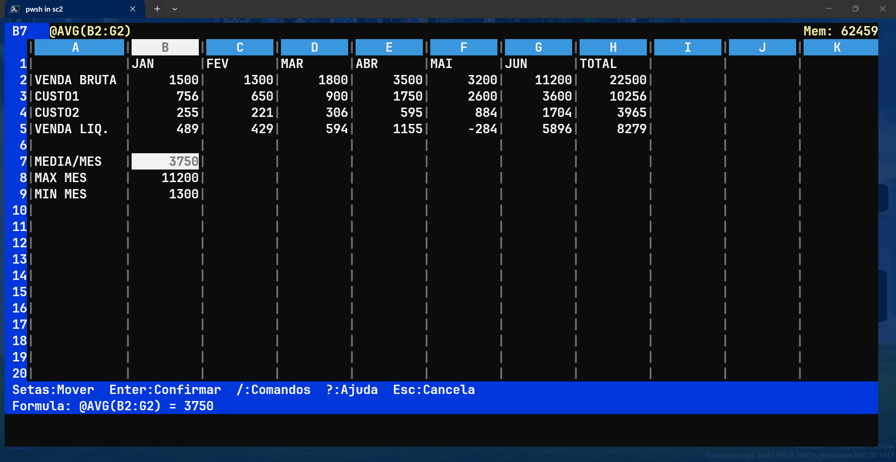

# SC2MSX — SuperCalc 2 para MSX, reimplementado em Go

> ⚠️ **Trabalho em progresso** — Este projeto está sendo construído aos poucos,
> com calma e cuidado, peça por peça. Não é um produto acabado.



---

## A história por trás do projeto

Tenho planilhas que uso **até hoje** no meu MSX. Sim, em 2026. Planilhas feitas
no **SuperCalc 2**, o software de spreadsheet da PRACTICA Informática Ltda.,
lançado no Brasil em 1989 para a plataforma MSX. Fórmulas, dados históricos,
cálculos que funcionam perfeitamente naquele ambiente — e que eu preciso continuar
usando, consultando e eventualmente expandindo.

O problema é que rodar um MSX real ou um emulador só para abrir uma planilha já
não é mais prático no dia a dia. E converter para Excel ou LibreOffice significa
perder a compatibilidade exata com o formato `.CAL` do SC2, que tem suas próprias
regras de fórmulas, formatação e estrutura de arquivo.

A solução? Reescrever o SuperCalc 2 MSX do zero, em Go, com interface de terminal
(TUI), compatível com o formato original. Assim posso abrir, editar e salvar
minhas planilhas no computador moderno — e se precisar, levar de volta pro MSX.

---

## O que é este projeto

**SC2MSX** é uma reimplementação fiel do SuperCalc 2 MSX escrita em Go, com
interface de terminal (TUI). O objetivo central é a **compatibilidade total**
com o SC2 original:

- Ler e escrever arquivos no formato **SDI** (SuperData Interchange), o formato
  nativo do SC2 MSX — compatível com arquivos `.CAL`
- Suportar todas as fórmulas e funções `@` do SC2 original, incluindo operadores
  relacionais e funções de calendário
- Simular a tela de **80 colunas × 24 linhas** do monitor MSX com layout idêntico
- Manter o mesmo comportamento de navegação, entrada de dados e comandos

Não é uma planilha genérica. É especificamente o SuperCalc 2 MSX.

---

## Ferramentas utilizadas

### Linguagem: **Go 1.21+**

Escolhido pela simplicidade, desempenho e excelente suporte a terminal. O
compilador estático facilita a distribuição — um único binário, sem dependências
de runtime.

```
https://go.dev
```

### Interface TUI: **tview**

Framework de interface de usuário para terminal, construído sobre o `tcell`.
Permite criar telas, caixas, modais e capturar eventos de teclado com precisão —
essencial para simular o comportamento de uma planilha em modo texto.

```
github.com/rivo/tview
```

### Suporte a terminal: **tcell v2**

Biblioteca de baixo nível para acesso ao terminal — controle de cores, células
individuais da tela, eventos de teclado e mouse. Toda a renderização da planilha
(células, cursor, cabeçalhos) é feita diretamente via `tcell.Screen`.

```
github.com/gdamore/tcell/v2
```

### Largura de caracteres: **go-runewidth**

Calcula a largura visual correta de cada caractere Unicode no terminal. Fundamental
para alinhar corretamente células com texto acentuado sem deslocamento visual —
um problema real ao usar `len()` com UTF-8.

```
github.com/mattn/go-runewidth
```

### Banco de dados: **SQLite + go-sqlite3**

Reservado para persistência interna futura — histórico de versões, auto-save,
metadados. O driver CGO do sqlite3 permite acesso direto e eficiente sem servidor.

```
github.com/mattn/go-sqlite3
```

### Referências e documentação utilizadas

- **Manual do SuperCalc 2 MSX** — Compucenter / Computer Associates, 1984, 213 páginas
  (lido integralmente página por página para garantir fidelidade ao original)
- **Manual do BarGraph** — PRACTICA Informática Ltda., 1989
  (complemento gráfico do SC2 MSX; revelou o formato de arquivo SDI)
- **Manual SuperCalc 2 Amsoft/UK** — versão inglesa para Amstrad, referência técnica
- **Arquivos `.BAT` originais** do disco mestre do SC2 MSX (`PORT-40`, `ING-80`, etc.)

---

## Estado atual do projeto

**Tamanho:** ~3.200 linhas de Go em 6 arquivos.

### ✅ Implementado

#### Tela de entrada (splash screen)
- Visual fiel ao estilo MSX: fundo preto, bordas ASCII, paleta ciano/amarelo
- Entrada por `Enter`, `Esc` ou `?`

#### Tela da planilha (80×24) — layout idêntico ao SC2 original
- **Linha 0 (status):** indicador de direção `>` + coordenada + tipo `(V/L/F)` +
  conteúdo bruto da célula + `Mem:NNNNN` — exatamente como no SC2
- **Linha 1:** cabeçalho de colunas com destaque na coluna do cursor
- **Linhas 2–21:** 20 linhas de dados com número de linha, separadores `|` e
  cursor invertido (preto no branco)
- **Linha 22:** barra de entrada/comando/status
- **Linha 23:** informação contextual — conteúdo da célula, ajuda rápida ou
  lista de comandos

#### Modelo de dados
- Planilha esparsa (map) — eficiente para qualquer tamanho
- Tipos de célula: `(V)` valor numérico · `(L)` label/texto · `(F)` fórmula
- Coordenadas SC2: A–BK (63 colunas), linhas 1–254
- Formatação: `G`eneral · `I`nteger · `F`ixed · `E`xponential · `$` Dollar ·
  `%` Percent · `*` Bar graph · `R/L/TR/TL` alinhamento
- Separador de milhares configurável
- Overflow numérico exibe `****` (padrão SC2)
- Texto truncado na borda da célula (sem overflow para a próxima)
- Scroll de viewport automático

#### Avaliador de fórmulas — compatível com SC2 MSX original
- **Operadores aritméticos:** `+` `-` `*` `/` `^` `( )`
- **Operadores relacionais:** `=` `<>` `<` `>` `<=` `>=`
  (retornam 1=verdadeiro ou 0=falso, como no SC2)
- **Referências de células:** `A1`, `B12`, `AA3`, `BK254`
- **Intervalos:** `A1:G5` dentro de funções
- **Funções aritméticas:**
  `@ABS` `@INT` `@SQRT` `@LOG` `@LOG10` `@LN` `@EXP` `@MOD` `@ROUND`
- **Funções trigonométricas:**
  `@SIN` `@COS` `@TAN` `@ASIN` `@ACOS` `@ATAN` `@ATAN2`
- **Funções de intervalo/lista:**
  `@SUM` `@AVG` `@AVERAGE` `@MIN` `@MAX` `@COUNT` `@STD` `@VAR` `@NPV`
- **Funções lógicas:**
  `@IF` `@AND` `@OR` `@NOT` `@TRUE` `@FALSE`
- **Funções especiais:**
  `@NA` `@ERROR` `@ISERROR` `@ISNA` `@PI` `@LOOKUP`
- **Funções de calendário:**
  `@DATE` `@JDATE` `@WDAY` `@MONTH` `@DAY` `@YEAR`
- **Erros nas células:** `#DIV/0!` `#REF!` `#VALUE!` `N/A` `#CIRC!` `#ERROR!`
- Recálculo automático a cada edição
- Proteção contra referências circulares

#### Regras de entrada de dados — idênticas ao SC2 original
| Primeiro caractere | Tipo | Exemplo |
|---|---|---|
| `"` | Texto (aspas removidas) | `"Total do mês` |
| `'` | Texto repetido | `'---` |
| Letra A–Z | Texto label | `VENDAS` |
| Nome de função | Fórmula automática | `SUM(A1:G1)` |
| Referência de célula | Fórmula automática | `A1` |
| Dígito ou `.` (puro) | Número | `1500` ou `3.14` |
| Dígito + operador | Fórmula | `4+5` ou `100/4` |
| `+` `-` `(` `@` | Fórmula | `+A1+B1` ou `@SUM(A1:A10)` |

#### Formato de arquivo SDI (SuperData Interchange)
- Leitura e escrita do formato `.SDI` — o formato de texto do SC2 MSX
- Compatível com arquivos `.CAL` via conversão SDI
- Suporte a: dados numéricos, texto, texto repetido, fórmulas, formatação por
  coluna, largura de colunas, formato global, especificadores de origem, contadores
  de repetição
- `/S` salva em `.SDI` · `/L` carrega de `.SDI`

#### Navegação e comandos implementados
- Setas, `Tab`, `Shift+Tab`, `PgUp`, `PgDn`, `Home`
- `=` → GoTo célula (como no SC2 original — ex: `=B12`)
- `!` → Recálculo manual forçado
- `Ctrl+F` / `Ctrl+B` → página de colunas para direita/esquerda
- `/B` Blank · `/Z` Zap · `/Q` Quit · `/S` Save · `/L` Load
- `/W` Width · `/F` Format · `/I` Insert · `/D` Delete · `/G` Global
- `Ctrl+Z` / `F2` → cancela entrada de dados

---

### 🔧 Em desenvolvimento

- **Formato `.CAL` binário** — leitura direta do formato binário do MSX
  (o `.SDI` é o intermediário; o `.CAL` binário é o próximo passo)
- **`/C` Copy** — copiar intervalo de células
- **`/M` Move** — mover intervalo de células
- **`/R` Replicate** — replicar fórmulas com ajuste de referências
- **`/T` Title** — travar linha/coluna de título (freeze)
- **`/W` Window** — janela dupla (dividir tela)
- **`/P` Protect / `/U` Unprotect** — proteção de células
- **`/E` Edit** — editar conteúdo da célula sem reescrever
- **`/O` Output** — configuração de impressão
- **`/X` Execute** — execução de macros `.XQT`

---

### 📋 Planejado

- **BarGraph** — gráficos de barras em modo texto a partir da planilha,
  compatível com o formato `.BGS`
- **Conversor SDI ↔ CAL** — conversão bidirecional entre formatos
- **Impressão** — saída compatível com impressoras matriciais padrão Epson
- **Persistência SQLite** — auto-save e histórico de versões

---

## Estrutura do projeto

```
sc2msx/
├── cmd/
│   └── sc2msx/
│       └── main.go                  # Ponto de entrada, planilha de exemplo
├── internal/
│   ├── spreadsheet/
│   │   ├── model.go                 # Células, coordenadas, planilha, formatação
│   │   ├── formula.go               # Parser e avaliador de fórmulas SC2
│   │   └── sdi.go                   # Leitor/gravador formato SDI (arquivo nativo)
│   └── ui/
│       ├── splash.go                # Tela de apresentação
│       └── grid.go                  # Planilha 80×24, modos, entrada, comandos
├── go.mod
├── setup.sh                         # Script de instalação automática
├── README.md                        # Este arquivo
└── MANUAL.md                        # Manual do usuário SC2MSX
```

---

## Como compilar e executar

### Requisitos

- Go 1.21 ou superior → https://go.dev/dl/
- GCC (para compilar o driver sqlite3 via CGO)
  - Linux: `sudo apt install gcc`
  - Windows: [MinGW-w64](https://www.mingw-w64.org/)
  - macOS: `xcode-select --install`

### Instalação com setup.sh (recomendado)

```bash
git clone <repo>
cd sc2msx
chmod +x setup.sh
./setup.sh
./sc2msx
```

### Instalação manual

```bash
cd sc2msx
go get github.com/rivo/tview@latest
go get github.com/gdamore/tcell/v2@latest
go get github.com/mattn/go-sqlite3@latest
go mod tidy
go build -o sc2msx ./cmd/sc2msx/
./sc2msx
```

---

## Sobre o SuperCalc 2 MSX original

O **SuperCalc 2** foi distribuído no Brasil pela **PRACTICA Informática Ltda.**
(Av. Açocê, 579 — São Paulo, SP), em 1989. Era vendido em disquete de 5¼" (face
dupla) ou 3½" (face simples), com versões para tela de 40 e 80 colunas, em
português e inglês.

O software foi originalmente desenvolvido pela **Sorcim Corporation** e
posteriormente pela **Computer Associates Micro Products Div.** (San Jose, CA),
com copyright de 1984. A versão MSX foi localizada e distribuída no Brasil pela
Compucenter Informática Ltda. e pela PRACTICA.

O disco mestre continha: `SC2.COM` (executável), `SC2.OVL` (overlay obrigatório),
`SC2.HLP` (ajuda), `BARGRAPH.BAS`, `BG1.BIN` e `IMPGRA.BIN` (gráficos), além
dos utilitários `SDI.COM` para conversão de formato.

---

*"Copiar é crime."* — contracapa do manual original, 1989.
Este projeto é uma reimplementação independente, sem uso de código do original.

Veja o [MANUAL.md](MANUAL.md) para instruções completas de uso.
